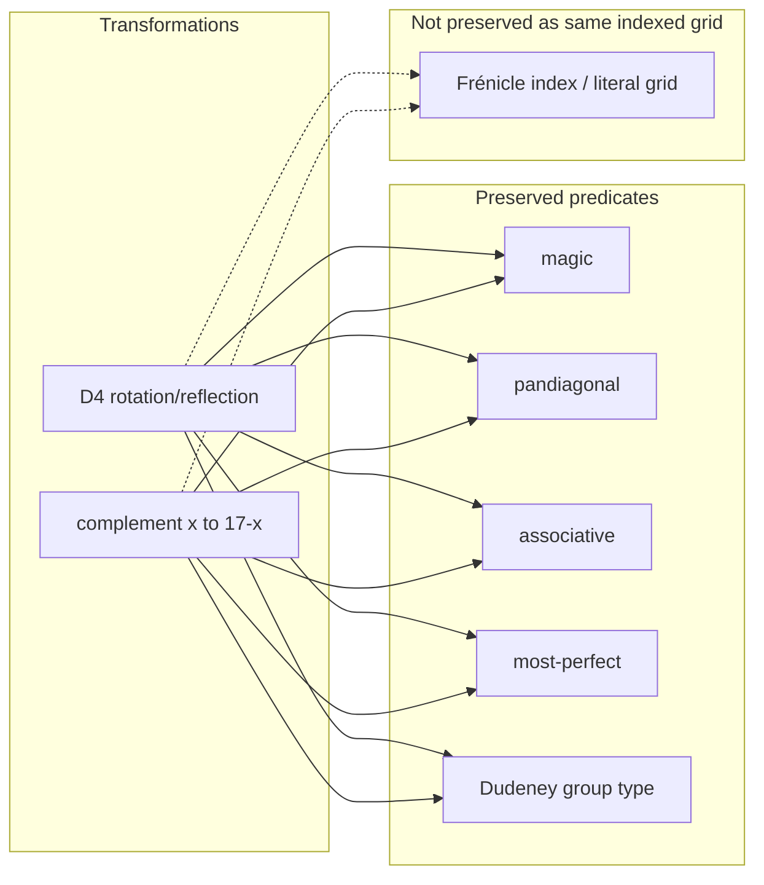

# Sub-subagent Report — 1215-M1-S3

**Agent:** 1215-M1-S3  
**Task:** Structural classification definitions and reproduced count checks  
**Manager:** 1215-M1  
**Status:** Complete

## Work Product

This deliverable defines structural classes for **normal order-4 magic squares** (the sixteen entries are a permutation of 1…16; each row, column, and main diagonal sums to 34). It separates geometric symmetries from entrywise complement, distinguishes overlapping author terminology, and reports **exact counts only where reproduced** by `classify_counts.py` against the Heinz/Frénicle 880-list CSV.

---

### 1. Normal magic square (baseline)

A **normal** square uses each integer 1…16 exactly once. It is **magic** when all four rows, four columns, and both main diagonals sum to the magic constant **M = 34** (= n(n²+1)/2 for n = 4).

All further classes below assume normality unless stated otherwise.

---

### 2. D4 geometric equivalence

**Definition.** Let D₄ be the dihedral group of order 8 acting on a 4×4 array by **rotations** (0°, 90°, 180°, 270°) and **reflections** (horizontal flip composed with rotation). Two squares are **D4-equivalent** if one is carried to the other by some element of D₄.

**Frénicle standard form** (canonical D4 representative used in the 880-list):

1. The **smallest corner entry** appears in the top-left cell.
2. The top-row neighbor **cell(1,2) < cell(2,1)** of the left-column neighbor.

Implementation: lexicographic minimum over the eight flat row-major images (`d4_canonical` in `classify_counts.py`).

**Reproduced counts (CSV audit):**

| Quantity | Reproduced | Literature claim |
|---|---:|---|
| D4 equivalence classes (Frénicle representatives) | **880** | 880 (Frénicle 1693; Ollerenshaw & Bondi 1982) |
| Oriented squares (all D4 images, union) | **7040** | 880 × 8 = 7040 |
| D4 orbit size for every CSV record | **8** (all) | 8 aspects per class (Heinz) |
| CSV rows already in Frénicle standard form | **880/880** | expected for Frénicle list |

**Stabilizer caveat.** 7040 = 880 × 8 holds only when **no square has D4 symmetry** (orbit size 8 for all). Our dataset satisfies this uniformly. In general, oriented count = Σ |orbit| ≤ 880 × 8; a square with symmetry would shrink its orbit (e.g. size 4 or 2).

**Invariance under D4.** Magicness, pandiagonality, bent-semi-pandiagonality, associativity, most-perfectness, and Dudeney complement-pair **pattern type** are preserved. Numeric metadata such as `group_orientation` may change under rotation/reflection.

---

### 3. Entrywise complement x ↦ 17 − x

**Definition.** For a normal order-4 square, the **complement** replaces every entry x with **17 − x** (since n² + 1 = 17). This is an involution on the set of normal squares.

**Distinction from D4.** Complement acts **entrywise** (x ↦ 17−x); D4 acts **positionally** (permutes cell locations). They are different operations and induce different equivalence relations on the set of squares.

**Commutation.** For every D4 symmetry g and every square S, **complement(g·S) = g·complement(S)**. Complement and D4 commute as transformations even though they are not the same map. (Verified on all 880 CSV records by `complement_commutes_with_d4` in `classify_counts.py`.)

**Self-complementary.** A square is **self-complementary** when its complement is **D4-equivalent** to itself (setwise, up to rotation/reflection):

`d4_canonical(complement(S)) = d4_canonical(S)`.

**Reproduced complement-orbit counts (on 880 D4 classes):**

| Quantity | Reproduced |
|---|---:|
| Total complement-orbits | **616** (= 352 fixed + 264 two-cycles) |
| Fixed complement-orbits (self-complementary representatives) | **352** |
| Two-cycle complement-orbits (264 pairs → 528 squares) | **264** |

**Invariance under complement.**

| Property | Preserved? | Notes |
|---|---|---|
| Magic | Yes | Pairwise complementary entries preserve all line sums |
| Pandiagonal | Yes | Broken diagonals remain magic |
| Most-perfect | Yes | 2×2 toroidal and diagonal-offset complements preserved |
| Associative | Yes | If a[r,c]+a[3−r,3−c]=17, then (17−a[r,c])+(17−a[3−r,3−c])=17 |
| Dudeney pattern group | Yes (same typology) | Complement may appear as a “disguised” square in same group |
| Frénicle index | No | Different representative; linked by `complement_id` in CSV |
| Same literal grid | No | Complement changes entries unless the square is a fixed point |

**Associative squares and D4.** For associative S, **complement(S) = rotate180(S)** (verified on all 48 associative records). Thus Group III squares need not be self-complementary as literal grids, but their complement is always a **180° rotation** — a D4 image — which explains how complement interacts with geometric symmetry.

---

### 4. Terminology map (avoid conflation)

| Term | Working definition | Order-4 notes |
|---|---|---|
| **Normal** | Uses 1…16 once | Baseline |
| **Magic / semi-magic** | All rows & columns sum to 34; **magic** also requires diagonal sums 34 | We require full magic |
| **Panmagic / pandiagonal / Nasik** | All **eight** broken (wrap-around) diagonals sum to 34 | Dudeney Group I |
| **Semi-pandiagonal / Semi-Nasik (broad)** | Dudeney typology Groups II–VI-P; **384 literature** | **Pattern-based**; not equivalent to one line-sum predicate (see §5) |
| **Bent-diagonal semi-pandiagonal** | Four opposite **short** diagonal quadruples each sum to 34 | Dudeney Group II; **48 reproduced** |
| **Associative / associated** | Center-symmetric complements: a[r,c]+a[3−r,3−c]=17 | Group III; **48 reproduced** |
| **Regular** | **Ambiguous** — often means “normal magic”; some texts use it for associative | We avoid “regular” unless context is quoted |
| **Most-perfect** (Ollerenshaw–Bree) | All **sixteen** 2×2 **toroidal** (wrap-around) blocks sum to 34 **and** entries two steps apart on diagonals are complementary (sum 17) | **48 reproduced**; for n=4, ⟺ pandiagonal (literature + reproduced) |
| **Compact (2×2 contiguous, non-toroidal)** | All **nine** contiguous 2×2 windows in the 4×4 grid sum to 34 | **48 reproduced**; distinct from most-perfect’s toroidal condition; coincides with pandiagonal at order 4 on our dataset |
| **Simple** | Magic but not in semi-pandiagonal/Nasik classes of Dudeney | Groups VI-S, VII–XII typologically |
| **Franklin** | Bent-diagonal construction for larger Franklin squares | **Not** a standard order-4 Frénicle/Dudeney class |

**Mutually exclusive (order 4, reproduced):** No square is both **pandiagonal** and **associative** (0/880). MathWorld states this explicitly for order 4.

---

### 5. Geometric subclasses and reproduced counts

Predicate implementations are in `classify_counts.py`. Results below are **reproduced** from  
`/Users/kylemathewson/MagicSK/MagicMomentExplorer/data/magic_squares_880.csv` (880 Frénicle representatives).

| Class | Definition (code predicate) | Reproduced count |
|---|---|---:|
| Magic | `is_magic` | 880 |
| Pandiagonal / panmagic / Nasik | all 8 broken diagonals magic | **48** |
| Bent-diagonal semi-pandiagonal | `is_bent_semi_pandiagonal` (Dudeney II) | **48** |
| Associative | center-symmetric complements | **48** |
| Most-perfect | sixteen toroidal 2×2 + diagonal-offset complements | **48** |
| Compact 2×2 (non-toroidal) | all nine contiguous 2×2 windows | **48** |
| Self-complementary | complement-orbit fixed point under D4 | **352** (within 616 total complement-orbits) |

**Broken-diagonal histogram (reproduced):**

| # broken diagonals equal to 34 | Count |
|---|---:|
| 2 | 360 |
| 3 | 8 |
| 4 | 464 |
| 8 | 48 |

**Literature claim NOT reproduced by a single predicate:** Dudeney’s aggregate **384 semi-pandiagonal** (Groups II, III, IV, V, VI-P: 48+48+96+96+96) is a **complement-pair pattern classification**, not equal to “≥4 broken diagonals” (464) nor “bent-diagonal semi” (48). Our CSV stores Dudeney group IDs; groups 2–5 sum to **288**, group 6 has **304** (literature splits 6 into VI-P 96 + VI-S 208).

**Dudeney group distribution (reproduced from CSV metadata):**

| Group | Count | Literature label |
|---:|---:|---|
| 1 | 48 | Nasik / pandiagonal |
| 2 | 48 | Bent-diagonal semi-pandiagonal |
| 3 | 48 | Semi-pandiagonal & associative |
| 4 | 96 | Semi-pandiagonal |
| 5 | 96 | Semi-pandiagonal |
| 6 | 304 | VI-P semi (96) + VI-S simple (208) per Heinz |
| 7–10 | 56 each | Simple |
| 11–12 | 8 each | Simple, limited symmetry |

Cross-check: Group I ⟹ pandiagonal (48/48); Group III ⟹ associative (48/48); zero squares both pandiagonal and associative.

---

### 6. Invariance summary



**Note:** D4 and complement **commute** (complement(g·S) = g·complement(S)) but generate **different** equivalence relations.

---

### 7. Reproducibility

**Run classification audit:**

```bash
python3 classify_counts.py \
  --csv /Users/kylemathewson/MagicSK/MagicMomentExplorer/data/magic_squares_880.csv \
  --output count_results.json
```

**Dataset provenance:** Harvey D. Heinz HTML transcription of Frénicle’s 880 squares (`order4lista.htm`–`order4listd.htm` on recmath.org). Normalization script: `MagicMomentExplorer/scripts/fetch_source.py` (read-only reference). Licensing: historical list; Heinz site is a community transcription — cite Frénicle (1693) as primary.

**Independent full enumeration:** Naive backtracking over all 16! assignments is in `--enumerate` mode but is **not used for reported counts** (runtime impractical without further symmetry breaking). Counts are reproduced from the validated 880-list plus D4 expansion.

---

### 8. Key literature vs reproduced

| Claim | Status |
|---|---|
| 880 Frénicle classes | **Reproduced** |
| 7040 oriented (= 880×8, all orbits size 8) | **Reproduced** |
| 48 pandiagonal / Nasik | **Reproduced** |
| 48 associative | **Reproduced** |
| 48 most-perfect; all pandiagonal order-4 are most-perfect | **Reproduced** |
| 384 semi-pandiagonal (Dudeney typological) | **Literature only** (pattern groups; not one geometric test) |
| 12 Dudeney complement-pair patterns | **Literature** (Ollerenshaw & Bondi 1982 prove necessity/sufficiency); group sizes **partially reproduced** via CSV metadata |
| 0 associative ∧ pandiagonal at order 4 | **Reproduced** |

Full bibliographic URLs: `literature_references.md`.

## Files

| File | Purpose |
|---|---|
| `S3_report.md` | This report |
| `classify_counts.py` | Runnable stdlib predicates, D4/complement utilities, CSV audit |
| `count_results.json` | Machine-readable reproduced counts (2026-07-09 run) |
| `literature_references.md` | URLs and bibliographic notes |

## Acceptance Criteria Check

| Criterion | Status |
|---|---|
| Define D4 geometric equivalence precisely | Done (§2) |
| Define complement x ↦ 17−x and distinguish from D4 | Done (§3) |
| Define associative / panmagic / pandiagonal / most-perfect without conflation | Done (§4–5) |
| Cover other defensible classes where sourced (semi-pandiagonal, compact, Dudeney) | Done; Franklin noted as out-of-scope for order 4 |
| Literature count claims with URLs | Done (`literature_references.md`) |
| Runnable verification code | Done (`classify_counts.py`) |
| Reproducible dataset or generator | Done (Heinz CSV audit + D4 expansion) |
| Exact counts only when reproduced; label literature claims | Done (tables in §2, §5, §8) |
| Explain invariance under D4 and complement | Done (§2, §3, §6) |
| Terminology variation between authors | Done (§4) |
| Write only inside assigned folder | Done |

## Questions for Manager

No questions — task was clear.

## Self-Assessment

- **Craftsperson says:** Corrections are applied consistently: Ollerenshaw & Bondi (1982) attribution, D4–complement commutation, associative invariance under complement, nine-window compact definition, and 616 complement-orbits (352 + 264). Transform identity checks pass on all 880 records.

- **Skeptic says:** “Semi-pandiagonal (384)” remains typological. Full from-scratch enumeration is still impractical in `--enumerate` mode. Group 6’s VI-P/VI-S split relies on Heinz metadata, not a single geometric predicate.

- **Mover says:** Manager corrections are incorporated without altering reproduced headline counts. The report, references, code comments, and JSON output now agree on the five flagged issues.

*Dated footer: 2026-07-09 — 1215-M1-S3*
